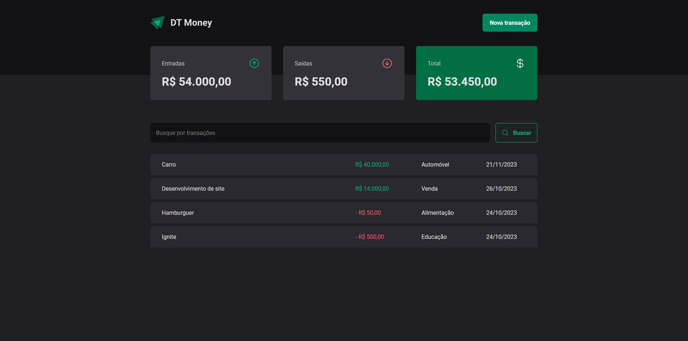
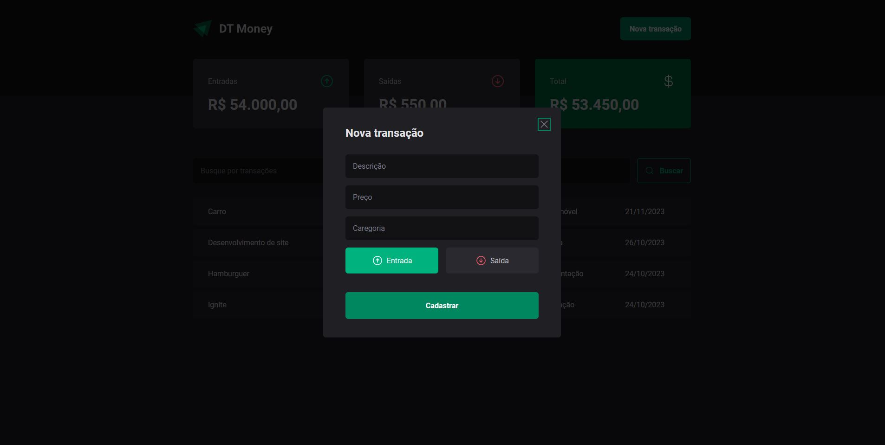

# DT Money 2.0 

Projeto Web desenvolvido durante o Bootcamp Ignite by Rocketseat • Trilha ReactJS - TEMA: "DT Money 2.0" 💲

### Descrição:

- [x] Listagem das transações (entradas e saídas);
- [x] Cálculo das entradas, saídas e total;
- [x] Campo de busca;
- [x] Modal para cadastro de nova transação;
- [x] Layout responsivo (mobile e desktop).


## Tecnologias utilizadas: 🚀

- ReactJs | ^18.2.0
- Vite | ^3.0.0 -D
- Typescript | ^4.6.4 -D
- Styled Components | ^5.3.5
- React Router Dom | ^6.3.0
- Radix UI (dialog e radio-group) | ^1.0.0
- React Hook Form | ^7.34.0
- JSON-Server | ^0.17.0 -D

### Desktop (screenshot):

| Transações  | Criar Transação | 
| --- | --- |
|  |  | 

## :clipboard: Pré-requisitos

- [Node.js 12+](https://nodejs.org/en/download/)
- [Yarn](https://classic.yarnpkg.com/en/docs/install/#windows-stable)

## :wrench: Instalação

Para clonar o projeto via HTTPS execute o seguinte comando:
```
git clone https://github.com/Luancss/Dtmoney-02
```
Em seguida instale as dependências:
```
npm install
```

## 🔨 Execução em ambiente de desenvolvimento

```
npm start
```
